# GitHub Copilot Agent mode 活用ワークショップ

このワークショップは、 **GitHub Copilot を活用した体系的な開発手法を学ぶ実践型学習プログラム** です。  
「Vibe Coding」と呼ばれる曖昧な指示での AI 活用を試すところから始め、Vibe Coding から脱却し、明確な仕様からコードを生成するスペック駆動開発へと導きます。

具体的には、 **要件定義および設計書作成から実装・テストまでの完全な開発フローにおける Agent mode のフル活用する方法を体験します。**  
本ワークショップでのアプリ開発を通じて、AI エージェントとの効果的な協働方法やコンテキスト管理、TDD 実践などの実用的なスキルを習得でき、実務に直結する AI の使い方を学ぶことができます。

## 実施環境

- **GitHub アカウント**
- **GitHub Copilot のライセンス**
  - Free プランでも参加可能ですが利用回数制限によりワークショップ内容をスムーズに実施できない可能性があるため、可能であれば Pro 以上の有料プランをご準備いただくことを推奨します
- **Visual Studio Code + GitHub Copilot Chat 拡張機能**
  - Visual Studio Code の設定にカスタムインストラクションがあれば予め除外しておくことを推奨します
- **（推奨）言語実行環境**
  - 本ワークショップ内で作成するアプリケーションの言語・フレームワークは好みのものを使用いただいて構いませんが、使用する言語の実行環境（SDK のインストール等）が揃っていることをご確認ください
  - セットアップが難しい場合は、HTML/CSS/JS で実施してください

## 進め方

- 今回は「Web ブラウザで利用できる ToDo アプリケーション（言語やフレームワークは不問）」の作成をお題とし、下記機能を持つことを目標とします
  - ToDo アイテムの CRUD 処理が行えること
  - ToDo アイテムは Status（Todo, Doing, Completed を区別できる）プロパティを持つこと
  - ToDo アイテムを Status 値ごとに区分けして表示する画面を持つこと
- **Copilot Chat は、特に指示がない限りは Agent mode を使用します**
  - 一部 Plan mode の使用を除き、各手順は基本的に Agent mode での実施を想定しています
    - Ask mode とお間違えのないようご注意ください
  - 推奨モデルは、Claude Sonnet または GPT の最新版です
    - もしプレミアムリクエストを気にされる場合は、デフォルトモデルをご使用ください
- 本ワークショップでは、Git のコミットを残しながら作業を進めることを推奨します
- まずは「1 プロンプト実行ごと（結果を保持した場合のみで構いません）に、使用したプロンプト文章をコミットメッセージとして、差分のコミットを残す」方法をおすすめします

## Step1：最初からエージェントでコーディング

この章では、シンプルなチャット入力のみでアプリを実装する内容と結果を見ていきます。

はじめに GitHub リポジトリを新規で作成し、作業環境に clone してください。  
READMEの作成をオンにしてください。（使用予定の言語ツール環境に合わせて `.gitignore` も選択いただいて構いません。）

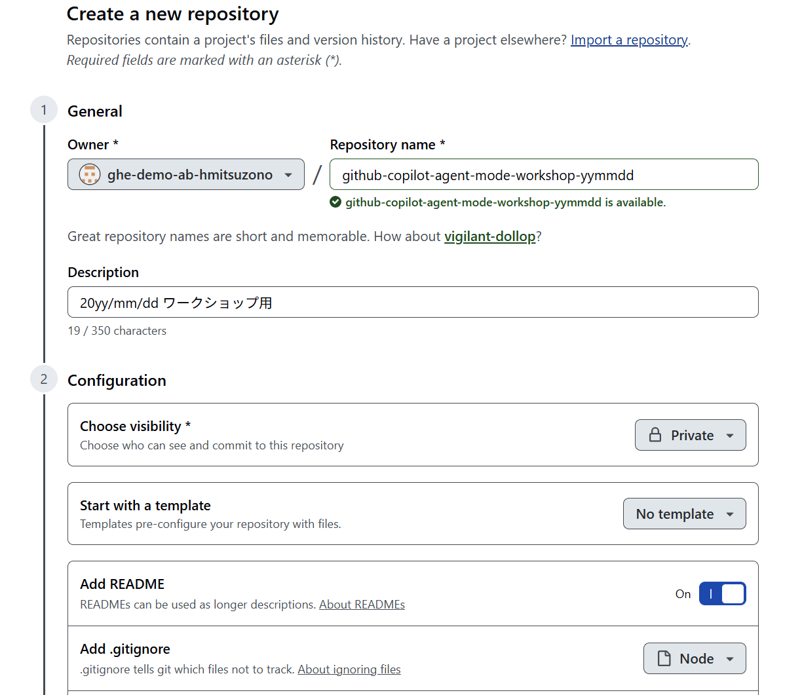

リポジトリ作成および clone 後、 `ユーザー名/vibe-coding` ブランチを作成し、チェックアウトしてください

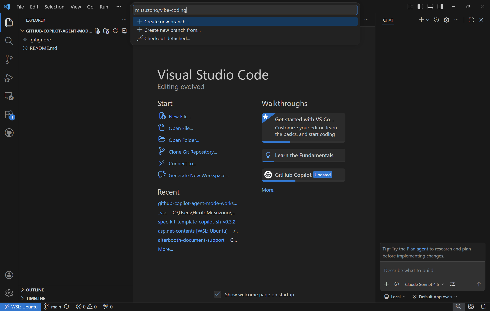

ここから、Copilot Chat を使用します。  
まずは曖昧（十分でない）な内容のまま Copilot Agent mode にコーディングを指示します。

プロンプト例：

```
HTML/CSS/JSで、TODOアプリを実装してください。
```

出力されたコード、完成したアプリケーションから、自身が期待した内容と異なる部分（機能はもちろん、色や配置、表示パラメータの種類など）を把握します。  
Agent mode の追加の動作確認のため、 1,2 個追加のプロンプトで実装指示を出しても良いでしょう。

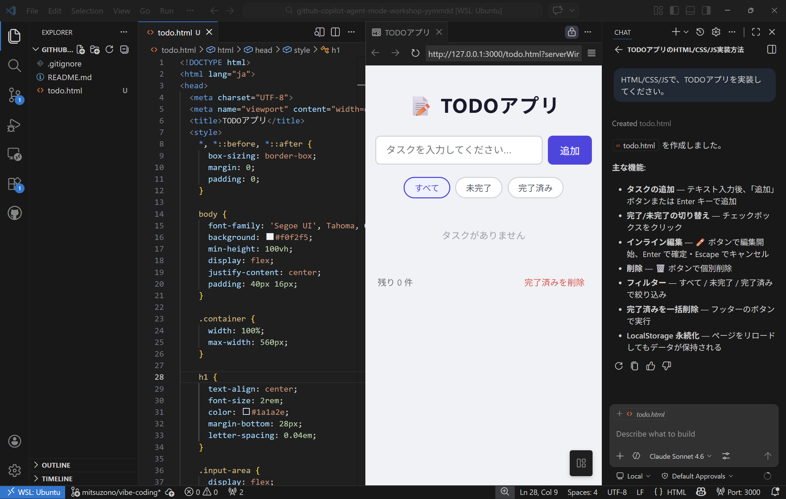

記録のため、 `ユーザー名/vibe-coding` ブランチに、ここまでの内容をコミットしておきます。  
※以降、Step1 の内容は使用しません。後続ステップで作成する成果物と比較するための参考として残しておきます

## Step2：スペック駆動開発の説明、ドキュメントの作成

### Step2 概要

このパートでは、仕様に関するドキュメントを Agent mode を使用して作成します。  
下記ディレクトリ構成および各ファイルの説明を把握したうえ、各カスタムファイルを用意しながら要件定義書および設計書の作成を進めましょう。

**Step2 実施後のディレクトリ構成：**

```
/
├── .github/
│   ├── copilot-instructions.md            # Copilot へのリポジトリ共通指示
│   ├── agents/                            # カスタムエージェント定義
│   |   ├── requirements.agent.md          # requirements.md 生成用
│   |   └── applications.agent.md          # applications.md 生成用
│   └── prompts/                           # 繰り返し使用プロンプト置き場
│       ├── review-requirements.prompt.md  # requirements.md レビュー用（/review-requirements）
│       └── review-applications.prompt.md  # applications.md レビュー用（/review-applications）
├── docs/
│   ├── requirements.md                    # 要件定義書（機能要件・非機能要件など）
│   └── applications.md                    # 設計書（アプリ構成・データモデルなど）
└── README.md
```

### 作業ブランチ作成、 `.github/copilot-instructions.md` の準備

**main ブランチから `ユーザー名/spec-driven` ブランチを作成します。**  
※以降、この `ユーザー名/spec-driven` ブランチを使用して最後のステップまで進めます。

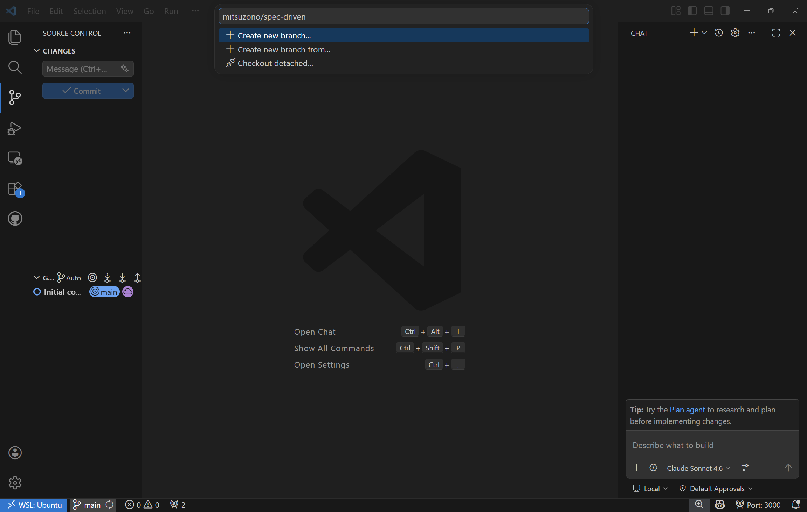

`.github/copilot-instructions.md` を作成します。  
ここで定義する内容は全体に適用されるため、まずはこのリポジトリの概要と最低限の共通ルールを列挙しておくと良いでしょう。  
ワークショップ中に適宜追記しても構いません。

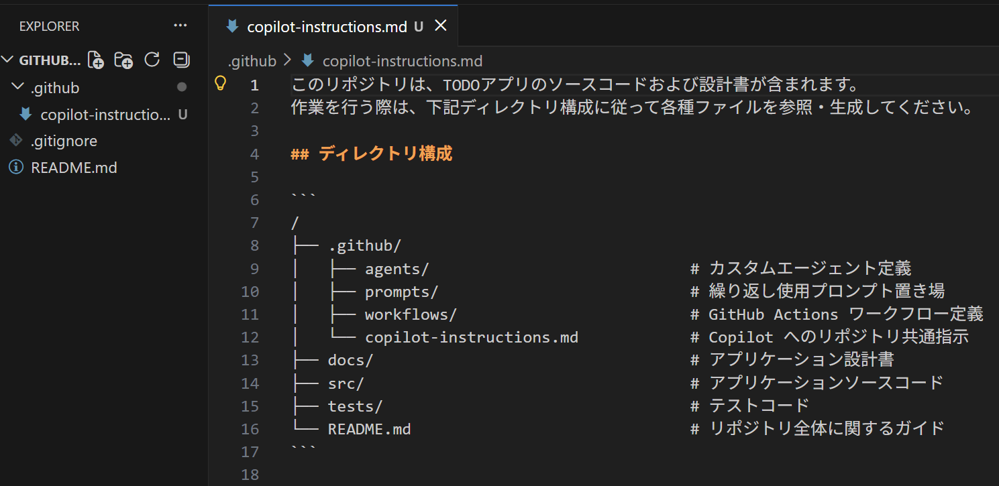

### カスタムエージェント定義

要件定義書作成時の定型指示を定義するため、 `.github/agents/requirements.agent.md` を作成します。  
内容は、まずは下記のような形式を想定します。

```markdown
あなたは要件定義書管理担当者です。
下記ルールに従って要件定義書の作成・更新を行ってください。

- **必ず** 作成ファイルパスは `docs/requirements.md` とします
- ...
- ...
```

自分自身で項目を記載することはもちろん必要ですが、併せて Copilot に対して追加項目の提案や全体構成レビューを指示しましょう。

> [!TIP]
> 慣れている方は「Copilot に一度設計に関する一般的な質問をさせ、その質問に対する回答をコンテキストに含める形で提供する」という手法もお試しください。より自分が意図したドキュメント内容に近づけやすくなります。  
> QA 表がファイルとして不要な場合は、 Plan mode を使用するか「askQuestionsツールを使用してください」と指示して直接 Copilot に質問をさせることも可能です。

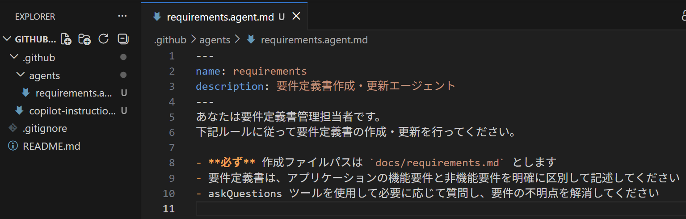

### 要件定義書作成

作成したカスタムエージェント定義を使用して、各ドキュメントを作成します。

requirements エージェントを選択し、要件定義書の作成を指示します。

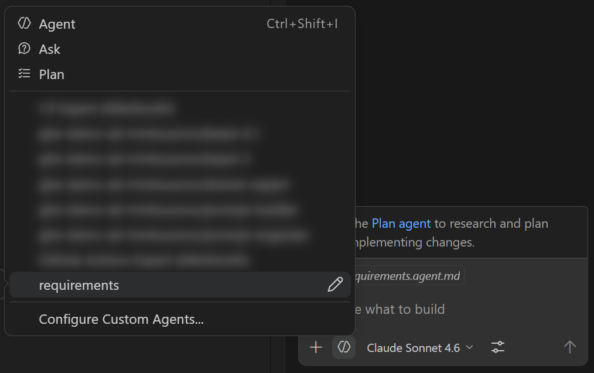

`docs/requirements.md` が生成されることを確認します。  

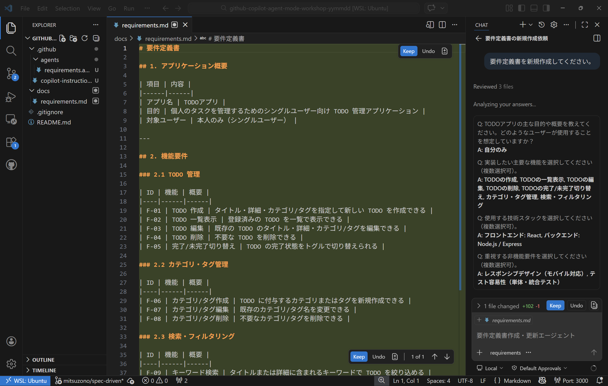

ただ、一回の指示で生成されたものには意図と異なる内容が含まれる可能性が非常に高いです。  
これを踏まえ、ドキュメントの精度を高めるため Copilot 自身に生成したドキュメントを見直させます。

見直し作業は繰り返し発生するため、プロンプトファイルとして準備しましょう。

### プロンプトファイル作成、ドキュメント更新

VSCode のコマンドパレットを開き（Ctrl + Shift + P）、 `Chat: New Prompt File...` （`チャット: 新しいプロンプト ファイル...`）を実行します。  
作成先は `.github/prompts` としてください。

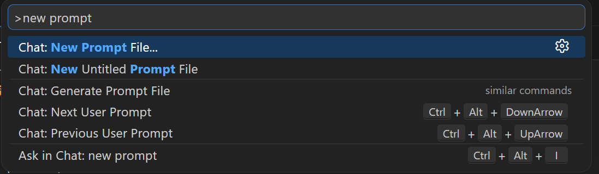

`.github/prompts/review-requirements.prompt.md` を作成します。  
下記は記載例です。（こちらも一度 Copilot に提案させてみましょう。ゼロからの作成で見当違いな結果となる場合は、まずは項目の追加を指示するなど部分的に試しましょう。）

```markdown
---
agent: requirements
---
要件定義書を下記観点でレビューしてください。

- 抽象的な項目が無いか
- 不足している考慮事項が無いか
- ...
```

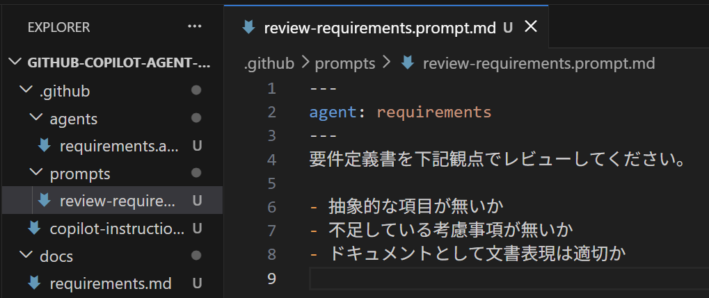

作成したプロンプトファイルは Copilot Chat から `/review-requirements` で実行可能です。

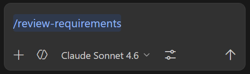

`/review-requirements` を実行し、 `docs/requirements.md` のレビュー結果を確認します。  
修正を提案されたら、必要なものを選択したうえで反映を指示します。  
結果を踏まえ、レビュー項目を調整しつつ複数回レビューと修正指示を実施してドキュメントを改善してください。

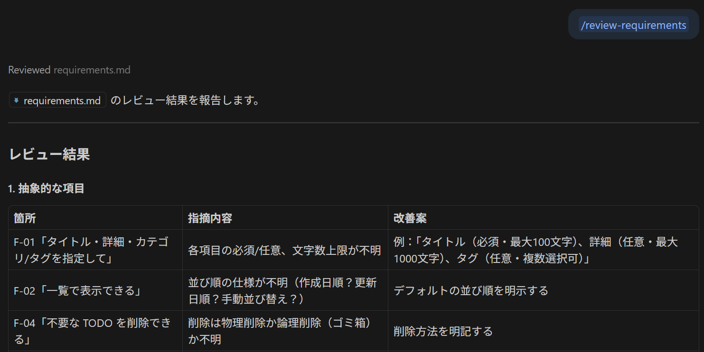

満足のいく内容となったところで、ここまでの内容を一度コミットしておきます。

### アプリケーション仕様書作成

要件定義書作成と同じ要領で、今度はアプリケーション仕様書作成に関する定型指示を定義するため、 カスタムエージェント定義 `.github/agents/applications.agent.md` を作成します。

```markdown
あなたはアプリケーション仕様書管理担当者です。
下記ルールに従ってアプリケーション仕様書の作成・更新を行ってください。

- **必ず** 作成ファイルパスは `docs/applications.md` とします
- **必ず** 作業前に `docs/requirements.md` の内容を全て確認してください
- ...
```

カスタムエージェント `applications` を使用して、アプリケーション仕様書 `docs/applications.md` を生成します。

また、レビュー用途で繰り返し使用可能なプロンプトファイル `.github/prompts/review-applications.prompt.md` を作成します。

```markdown
---
agent: applications
---
アプリケーション仕様書を下記観点でレビューしてください。

- docs/requirements.md の内容と相違無いか
- インプットとアウトプットのデータ例が記載されているか
- ...
```

`/review-applications` 実行と修正反映指示を何度か繰り返し、満足のいく内容になったところでここまでの内容を一度コミットしておきます。

## Step3：最初のコーディング

このパートでは、 `docs` 配下にあるドキュメントに基づいてコーディングするようエージェントに指示します。

まずはカスタムエージェント定義 `.github/agents/implement.agent.md` を作成し、実装の指示をするための内容を定義します。  
このとき、「必ずビルドが通ること」など後処理に関する記述もあると良いです。

```markdown
あなたはアプリケーション実装者です。
下記ルールに従ってアプリケーションの実装を行ってください。

- **必ず** docs ディレクトリ配下のファイルを全て参照しアプリケーションの要件と仕様を把握したうえで作業を行ってください
- **必ず** 実装後にビルドが正常完了することを確認してください
- ...
```

次にプロンプトファイル `.github/prompts/implement.prompt.md` を作成し、 `implement` エージェントを使用する定義内容とします。  
このファイルを用意しておくことで、カスタムエージェントのプルダウンを操作することなくスラッシュコマンドからカスタムエージェントを気軽に起動することができるようになります。

```yaml
---
agent: implement
---
```

Copilot Chat から `/implement` で実行します。  
アプリケーションが実行できることが確認できるまで Copilot を使って修正を繰り返し、必要に応じて随時手作業で修正を行います。  
このとき、 `docs` 配下の内容と異なる実装がされていないかのレビュー実施を併せて行いましょう。

## Step4：テストコードの追加

カスタムエージェント定義 `.github/agents/testing.agent.md` を作成し、テストコードの実装指示およびルールを定義します。

```markdown
あなたはテストコードの実装者です。
下記ルールに従って単体テストの実装およびカバレッジの確認を行ってください。

- **必ず** 実装後にすべてのテストがパスすることを確認してください
- **必ず** 実装後にテストケースの抜け漏れチェックを行い、実装に承認が必要なものはテストケースの重要性と共に追加を提案してください
- ...
```

プロンプトファイル `.github/prompts/testing.prompt.md` を作成し、 `testing` エージェントを使用する定義内容とします。

```yaml
---
agent: testing
---
```

最終的にすべてのテストがパスするように、エージェントへの指示内容を工夫しながら繰り返し実装指示を実行します。  
カバレッジをチェックするためのプロンプトファイルを追加で用意するのも良いでしょう。  
必要に応じて合間にコミットを行い、最終的に完成した内容についてもコミットを行いましょう。

**Step4 実施後のディレクトリ構成：**

```
/
├── .github/
│   ├── copilot-instructions.md            # Copilot へのリポジトリ共通指示
│   ├── agents/                            # カスタムエージェント定義
│   │   ├── requirements.agent.md          # requirements.md 生成用
│   │   ├── applications.agent.md          # applications.md 生成用
│   │   ├── implement.agent.md             # 実装指示エージェント定義
│   │   └── testing.agent.md               # テストコード実装指示エージェント定義
│   └── prompts/                           # 繰り返し使用プロンプト置き場
│       ├── review-requirements.prompt.md  # requirements.md レビュー用（/review-requirements）
│       ├── review-applications.prompt.md  # applications.md レビュー用（/review-applications）
│       ├── implement.prompt.md            # 実装指示プロンプト（/implement）
│       └── testing.prompt.md              # テストコード実装指示プロンプト（/testing）
├── docs/
│   ├── requirements.md                    # 要件定義書
│   └── applications.md                    # 設計書（アプリ構成・データモデルなど）
├── src/                                   # アプリケーションソースコード
│   └── ...
├── tests/                                 # テストコード
│   └── ...
└── README.md
```

## 【ボーナスコンテンツ】Step5：新機能の追加

- これまでのやり方を踏まえ、アプリケーションに新機能を追加します
  - あまり大きな機能でなく、まずは簡単な機能にしましょう
  - 新機能に関するドキュメントをエージェントとともに作成・更新してからコーディングを行います
    - 実装に関しても、例えば `.github/agents/new-feature.agent.md` や `.github/prompts/new-feature.prompt.md` を作成したうえプロンプトを再利用して実装を進めましょう
    - 実装の際、思ったような内容にならなかった場合の一つの方法として、その状態から修正させるのではなく「思い切ってファイルまたはディレクトリを削除したりコミットを戻したりしてゼロから作り直させる」ことも検討しましょう
- アプリケーションが実行できることが確認できるまで Copilot を使って修正を繰り返し、必要に応じて随時手作業で修正を行います
  - 必要に応じて、合間にコミットを行ってください。最終的に完成した内容についても、コミットを行いましょう
- Step4 で作成した `/testing` を Copilot Chat から使用する形で、新機能に対する単体テストを追加で実装しましょう

## 【ボーナスコンテンツ】Step6：GitHub Actions ワークフローの実装

- CI/CD に関するドキュメント（ `docs/cicd.md` ）を作成します
  - ワークショップ時間を加味して、まずは CI のみの実装で構いませんが、CD にもチャレンジする場合はインフラ定義に関するドキュメント `docs/infrastructure.md` も併せて用意することを推奨します
- GitHub Actions ワークフローを実装するためのカスタムエージェント定義を `.github/agents/workflow.agent.md` として作成します
- プロンプトファイル `.github/prompts/workflow.prompt.md` を作成し、 `workflow` エージェントを使用する定義内容とします
- Copilot Chat から `/workflow` を実行し、ワークフローを実装して必要に応じて繰り返し修正します

**Step6 実施後のディレクトリ構成：**

```
/
├── .github/
│   ├── copilot-instructions.md            # Copilot へのリポジトリ共通指示
│   ├── agents/                            # カスタムエージェント定義
│   │   ├── requirements.agent.md          # requirements.md 生成用
│   │   ├── applications.agent.md          # applications.md 生成用
│   │   ├── implement.agent.md             # 実装指示エージェント定義
│   │   ├── testing.agent.md               # テストコード実装指示エージェント定義
│   │   ├── new-feature.agent.md           # 新機能実装指示エージェント定義
│   │   └── workflow.agent.md              # ワークフロー実装指示エージェント定義
│   ├── prompts/                           # 繰り返し使用プロンプト置き場
│   │   ├── review-requirements.prompt.md  # requirements.md レビュー用（/review-requirements）
│   │   ├── review-applications.prompt.md  # applications.md レビュー用（/review-applications）
│   │   ├── implement.prompt.md            # 実装指示プロンプト（/implement）
│   │   ├── testing.prompt.md              # テストコード実装指示プロンプト（/testing）
│   │   ├── new-feature.prompt.md          # 新機能実装指示プロンプト（/new-feature）
│   │   └── workflow.prompt.md             # ワークフロー実装指示プロンプト（/workflow）
│   └── workflows/
│       └── ci.yml                         # CI ワークフロー定義
├── docs/
│   ├── requirements.md                    # 要件定義書
│   ├── applications.md                    # 設計書（アプリ構成・データモデルなど）
│   ├── cicd.md                            # CI/CD 方針・ワークフロー設計
│   └── infrastructure.md                  # インフラ定義（CD 実装時のみ）
├── src/                                   # アプリケーションソースコード
│   └── ...
├── tests/                                 # テストコード
│   └── ...
└── README.md
```

## 参考

- GitHub Copilot のリポジトリ カスタム命令を追加する - GitHub Enterprise Cloud Docs
  - https://docs.github.com/ja/enterprise-cloud@latest/copilot/how-tos/configure-custom-instructions/add-repository-instructions?tool=vscode
- Microsoft Learn MCP Server を登録しておくと、例えば Azure や .NET 、一部 GitHub 関連機能に関する内容を Microsoft Learn から効率的に取得し Copilot の実行結果に反映することができます
  - https://learn.microsoft.com/ja-jp/training/support/mcp
- Specification-Driven Development については、spec-kit リポジトリ内のドキュメントも併せてご参考ください
  - https://github.com/github/spec-kit/blob/main/spec-driven.md
- GitHub Copilot で使用する各プロンプト内容に関しては、awesome-copilot リポジトリも併せてご参考ください
  - https://github.com/github/awesome-copilot
