# GitHub Copilot Agent mode 活用ワークショップ

このワークショップでは、GitHub Copilotを活用した体系的な開発手法を実践形式で学びます。曖昧な指示でAIに開発させる「Vibe Coding」から始め、明確な仕様に基づいてコードを生成するスペック駆動開発へ進みます。

要件定義や設計から実装・テストまでの開発フローを通じて、Agent modeの活用方法を体験します。アプリ開発を進めながら、AIエージェントとの協働、コンテキスト管理、TDDなど、実務に役立つスキルを身につけます。

## 実施環境

- GitHubアカウント
- GitHub Copilotのライセンス
  - Freeプランでも参加できます。ただし、利用回数に制限があるため、ワークショップを円滑に進められない場合があります。可能であれば、Pro以上の有料プランをおすすめします。
- Visual Studio CodeとGitHub Copilot Chat拡張機能
  - Visual Studio Codeにカスタムインストラクションを設定している場合は、事前に無効にしておくことをおすすめします。
- 言語の実行環境（推奨）
  - アプリケーションの言語やフレームワークは自由です。使用する言語の実行環境（SDKなど）がインストールされていることをご確認ください。
  - 環境のセットアップが難しい場合は、HTML/CSS/JavaScriptで進めてください。

## 進め方

- 今回は、Webブラウザーで使えるToDoアプリケーションを作成します。言語やフレームワークは問いません。次の機能を実装することを目指します。
  - ToDoアイテムの作成・読み取り・更新・削除（CRUD）
  - Todo、Doing、Completedの状態を持つToDoアイテム
  - 状態ごとにToDoアイテムを表示する画面
- 特に指定がない場合、Copilot ChatではAgent modeを使用します。
  - 一部でPlan modeを使いますが、基本的にはAgent modeで進めます。Ask modeと間違えないようにしてください。
  - 推奨モデルはClaude Sonnetまたは最新のGPTモデルです。プレミアムリクエストを節約したい場合は、既定のモデルを使用してください。
- Gitのコミットを残しながら作業することをおすすめします。
- まずは、プロンプトの実行結果を採用する場合に、そのプロンプト文をコミットメッセージとして差分をコミットする方法がおすすめです。

## Step 1 最初からエージェントでコーディング

この章では、シンプルなプロンプトだけでアプリを実装し、その結果を確認します。

まず、GitHubにリポジトリを作成し、作業環境にcloneします。作成時にREADMEも有効にしてください。使用する言語やツールに合わせて、`.gitignore`を選んでも構いません。

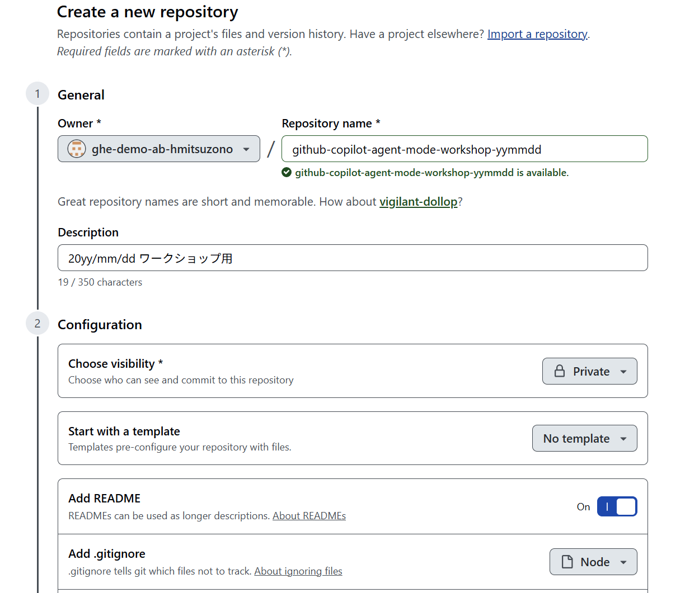

リポジトリを作成してcloneしたら、`ユーザー名/vibe-coding`ブランチを作成してチェックアウトします。

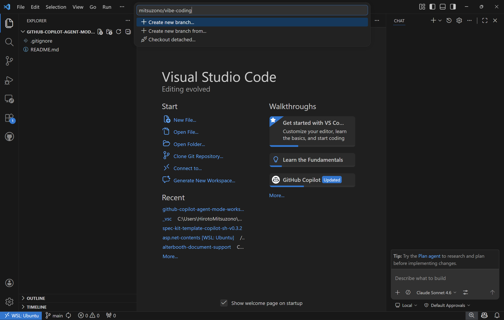

ここからCopilot Chatを使います。まずは、あえて曖昧な指示をAgent modeに与えて、コーディングを依頼します。

プロンプト例

```
HTML/CSS/JSで、TODOアプリを実装してください。
```

生成されたコードとアプリケーションを確認し、期待と異なる点を把握します。機能だけでなく、色や配置、表示する項目なども確認しましょう。Agent modeの動作をさらに試すため、プロンプトを1、2回追加しても構いません。

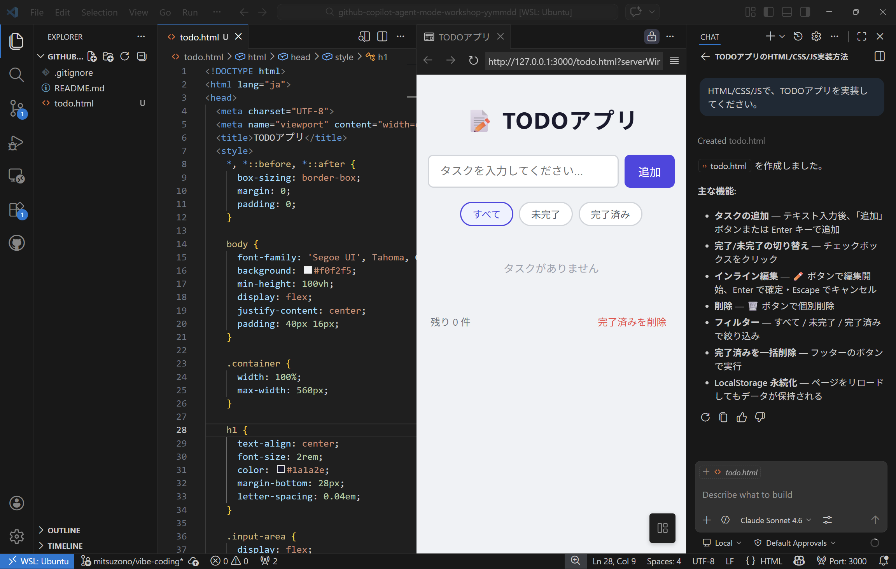

記録として、ここまでの変更を`ユーザー名/vibe-coding`ブランチにコミットします。以降、Step 1の成果物は使用しませんが、後の成果物と比較できるように残しておきます。

## Step 2 スペック駆動開発とドキュメントの作成

### Step 2 概要

このパートでは、Agent modeを使って仕様に関するドキュメントを作成します。以下のディレクトリ構成と各ファイルの役割を確認し、必要なカスタムファイルを用意しながら要件定義書と設計書を作成します。

**Step 2終了時のディレクトリ構成**

```
/
├── .github/
│   ├── copilot-instructions.md            # Copilot へのリポジトリ共通指示
│   ├── agents/                            # カスタムエージェント定義
│   |   ├── requirements.agent.md          # requirements.md 生成用
│   |   └── applications.agent.md          # applications.md 生成用
│   └── prompts/                           # 繰り返し使用プロンプト置き場
│       ├── review-requirements.prompt.md  # requirements.md レビュー用（/review-requirements）
│       └── review-applications.prompt.md  # applications.md レビュー用（/review-applications）
├── docs/
│   ├── requirements.md                    # 要件定義書（機能要件・非機能要件など）
│   └── applications.md                    # 設計書（アプリ構成・データモデルなど）
└── README.md
```

### 作業ブランチと `.github/copilot-instructions.md` の準備

`main`ブランチから`ユーザー名/spec-driven`ブランチを作成します。以降、最後のステップまでこのブランチで作業します。

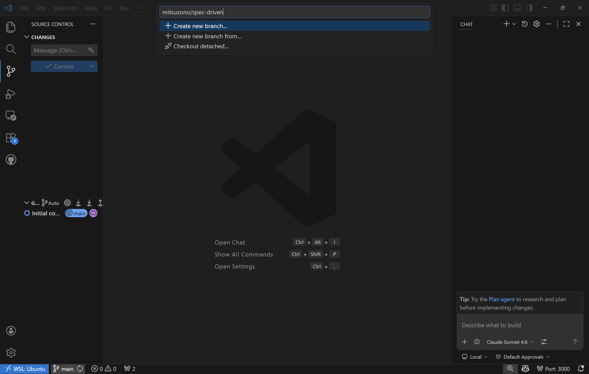

`.github/copilot-instructions.md`を作成します。ここに記載した内容はリポジトリ全体に適用されます。まずはリポジトリの概要と基本的な共通ルールを記載し、必要に応じてワークショップ中に追記してください。

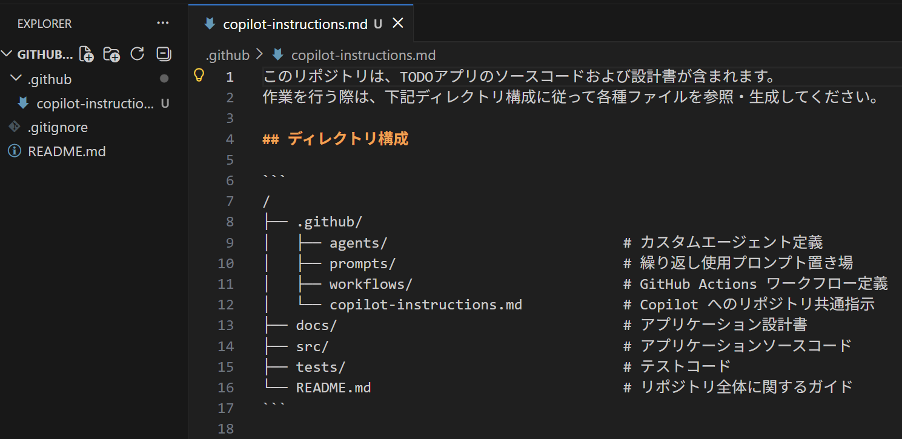

### カスタムエージェントの定義

要件定義書を作成するときの指示を定義するため、`.github/agents/requirements.agent.md`を作成します。まずは、次のような内容から始めます。

```markdown
あなたは要件定義書管理担当者です。
下記ルールに従って要件定義書の作成・更新を行ってください。

- **必ず** 作成ファイルパスは `docs/requirements.md` とします
- ...
- ...
```

必要な項目を自分で記載したうえで、Copilotにも項目の追加提案や全体構成のレビューを依頼しましょう。

> [!TIP]
> 慣れている方は、Copilotに設計に関する質問をさせ、その回答をコンテキストに含めてから文書を作成する方法も試してください。意図に沿った内容に仕上げやすくなります。
> QA表をファイルとして残す必要がなければ、Plan modeを使うか、「askQuestionsツールを使用してください」と指示して、Copilotに直接質問させる方法もあります。

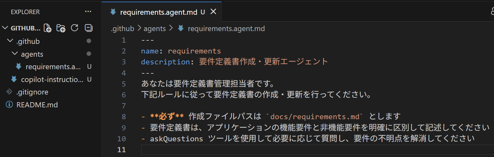

### 要件定義書の作成

作成したカスタムエージェントを使って、ドキュメントを作成します。`requirements`エージェントを選び、要件定義書の作成を指示してください。

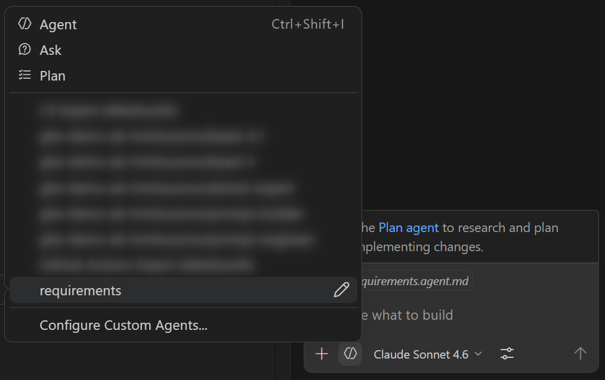

`docs/requirements.md` が生成されることを確認します。  

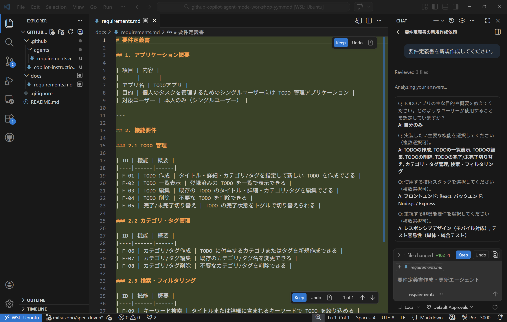

一度の指示で生成した文書には、意図と異なる内容が含まれることがあります。文書の精度を高めるため、Copilotに生成した文書をレビューさせましょう。

レビューは繰り返し行うため、プロンプトファイルを用意します。

### プロンプトファイルの作成とドキュメントの更新

VS Codeでコマンドパレット（Ctrl + Shift + P）を開き、`Chat: New Prompt File...`（日本語表示では「チャット: 新しいプロンプト ファイル...」）を実行します。作成先に`.github/prompts`を指定してください。

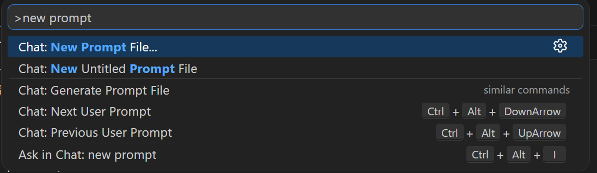

`.github/prompts/review-requirements.prompt.md`を作成します。次の例を参考にしてください。プロンプトの作成もCopilotに提案させてみましょう。意図と異なる案が出た場合は、まず項目の追加を指示するなど、部分的に試してください。

```markdown
---
agent: requirements
---
要件定義書を下記観点でレビューしてください。

- 抽象的な項目が無いか
- 不足している考慮事項が無いか
- ...
```

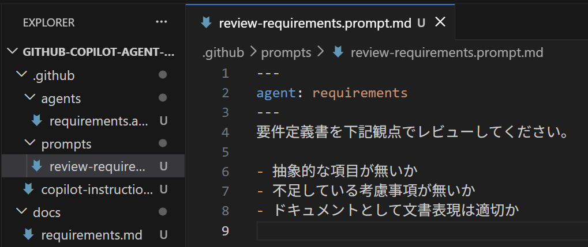

作成したプロンプトファイルは、Copilot Chatから`/review-requirements`で実行できます。

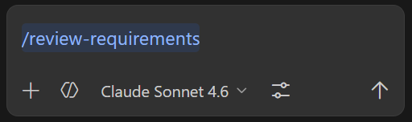

`/review-requirements`を実行し、`docs/requirements.md`のレビュー結果を確認します。修正案のうち必要なものを選び、反映を指示してください。レビュー項目も調整しながら、レビューと修正を繰り返して文書を改善します。

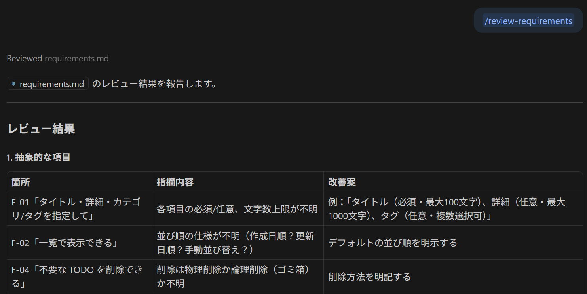

内容に納得できたら、ここまでの変更をコミットします。

### アプリケーション仕様書の作成

要件定義書と同じ要領で、アプリケーション仕様書の作成指示を定義します。カスタムエージェント`.github/agents/applications.agent.md`を作成してください。

```markdown
あなたはアプリケーション仕様書管理担当者です。
下記ルールに従ってアプリケーション仕様書の作成・更新を行ってください。

- **必ず** 作成ファイルパスは `docs/applications.md` とします
- **必ず** 作業前に `docs/requirements.md` の内容を全て確認してください
- ...
```

`applications`エージェントを使って、アプリケーション仕様書`docs/applications.md`を作成します。

続けて、レビューに繰り返し使うプロンプトファイル`.github/prompts/review-applications.prompt.md`を作成します。

```markdown
---
agent: applications
---
アプリケーション仕様書を下記観点でレビューしてください。

- docs/requirements.md の内容と相違無いか
- インプットとアウトプットのデータ例が記載されているか
- ...
```

`/review-applications`を実行し、修正を反映する作業を何度か繰り返します。内容に納得できたら、ここまでの変更をコミットします。

## Step 3 最初のコーディング

このパートでは、エージェントに`docs`配下のドキュメントに基づいて実装するよう指示します。

まず、実装の指示を定義するカスタムエージェント`.github/agents/implement.agent.md`を作成します。「実装後にビルドが通ることを確認する」など、作業後の確認事項も記載してください。

```markdown
あなたはアプリケーション実装者です。
下記ルールに従ってアプリケーションの実装を行ってください。

- **必ず** docs ディレクトリ配下のファイルを全て参照しアプリケーションの要件と仕様を把握したうえで作業を行ってください
- **必ず** 実装後にビルドが正常完了することを確認してください
- ...
```

次に、`implement`エージェントを使うプロンプトファイル`.github/prompts/implement.prompt.md`を作成します。このファイルを用意すると、エージェントのプルダウンを操作せず、スラッシュコマンドから起動できます。

```yaml
---
agent: implement
---
```

Copilot Chatから`/implement`を実行します。アプリケーションが動作するまでCopilotに修正を依頼し、必要に応じて手作業でも修正してください。また、実装が`docs`配下の内容に沿っているかレビューしましょう。

## Step 4 テストコードの追加

テストの実装指示とルールを定義するカスタムエージェント`.github/agents/testing.agent.md`を作成します。

```markdown
あなたはテストコードの実装者です。
下記ルールに従って単体テストの実装およびカバレッジの確認を行ってください。

- **必ず** 実装後にすべてのテストがパスすることを確認してください
- **必ず** 実装後にテストケースの抜け漏れチェックを行い、実装に承認が必要なものはテストケースの重要性と共に追加を提案してください
- ...
```

`testing`エージェントを使うプロンプトファイル`.github/prompts/testing.prompt.md`を作成します。

```yaml
---
agent: testing
---
```

すべてのテストがパスするまで、エージェントへの指示を調整しながら実装を繰り返します。カバレッジ確認用のプロンプトファイルを追加してもよいでしょう。作業の途中で必要に応じてコミットし、完成した内容もコミットしてください。

**Step 4終了時のディレクトリ構成**

```
/
├── .github/
│   ├── copilot-instructions.md            # Copilot へのリポジトリ共通指示
│   ├── agents/                            # カスタムエージェント定義
│   │   ├── requirements.agent.md          # requirements.md 生成用
│   │   ├── applications.agent.md          # applications.md 生成用
│   │   ├── implement.agent.md             # 実装指示エージェント定義
│   │   └── testing.agent.md               # テストコード実装指示エージェント定義
│   └── prompts/                           # 繰り返し使用プロンプト置き場
│       ├── review-requirements.prompt.md  # requirements.md レビュー用（/review-requirements）
│       ├── review-applications.prompt.md  # applications.md レビュー用（/review-applications）
│       ├── implement.prompt.md            # 実装指示プロンプト（/implement）
│       └── testing.prompt.md              # テストコード実装指示プロンプト（/testing）
├── docs/
│   ├── requirements.md                    # 要件定義書
│   └── applications.md                    # 設計書（アプリ構成・データモデルなど）
├── src/                                   # アプリケーションソースコード
│   └── ...
├── tests/                                 # テストコード
│   └── ...
└── README.md
```

## ボーナスコンテンツ Step 5 新機能の追加

これまでの進め方を参考に、アプリケーションへ新機能を追加します。

- まずは小さな機能を選びます。
- コーディングの前に、エージェントと新機能のドキュメントを作成・更新します。
- 実装用に`.github/agents/new-feature.agent.md`や`.github/prompts/new-feature.prompt.md`を作成し、プロンプトを再利用してもよいでしょう。
- 実装が意図どおりにならない場合は、その場で修正を重ねるだけでなく、ファイルやディレクトリを削除したり、コミットを戻したりして、最初から作り直す方法も検討してください。
- アプリケーションが動作するまでCopilotに修正を依頼し、必要に応じて手作業でも修正します。作業中は必要に応じてコミットし、完成した内容もコミットしてください。
- Step 4で作成した`/testing`をCopilot Chatから実行し、新機能の単体テストを追加します。

## ボーナスコンテンツ Step 6 GitHub Actionsワークフローの実装

- CI/CDに関するドキュメント`docs/cicd.md`を作成します。
  - ワークショップの時間を考慮し、まずはCIのみを実装しても構いません。CDにも取り組む場合は、インフラ定義のドキュメント`docs/infrastructure.md`も用意することをおすすめします。
- GitHub Actionsのワークフローを実装するカスタムエージェント`.github/agents/workflow.agent.md`を作成します。
- `workflow`エージェントを使うプロンプトファイル`.github/prompts/workflow.prompt.md`を作成します。
- Copilot Chatから`/workflow`を実行してワークフローを実装し、必要に応じて修正を繰り返します。

**Step 6終了時のディレクトリ構成**

```
/
├── .github/
│   ├── copilot-instructions.md            # Copilot へのリポジトリ共通指示
│   ├── agents/                            # カスタムエージェント定義
│   │   ├── requirements.agent.md          # requirements.md 生成用
│   │   ├── applications.agent.md          # applications.md 生成用
│   │   ├── implement.agent.md             # 実装指示エージェント定義
│   │   ├── testing.agent.md               # テストコード実装指示エージェント定義
│   │   ├── new-feature.agent.md           # 新機能実装指示エージェント定義
│   │   └── workflow.agent.md              # ワークフロー実装指示エージェント定義
│   ├── prompts/                           # 繰り返し使用プロンプト置き場
│   │   ├── review-requirements.prompt.md  # requirements.md レビュー用（/review-requirements）
│   │   ├── review-applications.prompt.md  # applications.md レビュー用（/review-applications）
│   │   ├── implement.prompt.md            # 実装指示プロンプト（/implement）
│   │   ├── testing.prompt.md              # テストコード実装指示プロンプト（/testing）
│   │   ├── new-feature.prompt.md          # 新機能実装指示プロンプト（/new-feature）
│   │   └── workflow.prompt.md             # ワークフロー実装指示プロンプト（/workflow）
│   └── workflows/
│       └── ci.yml                         # CI ワークフロー定義
├── docs/
│   ├── requirements.md                    # 要件定義書
│   ├── applications.md                    # 設計書（アプリ構成・データモデルなど）
│   ├── cicd.md                            # CI/CD 方針・ワークフロー設計
│   └── infrastructure.md                  # インフラ定義（CD 実装時のみ）
├── src/                                   # アプリケーションソースコード
│   └── ...
├── tests/                                 # テストコード
│   └── ...
└── README.md
```

## 参考

- GitHub Copilot のリポジトリ カスタム命令を追加する - GitHub Enterprise Cloud Docs
  - https://docs.github.com/ja/enterprise-cloud@latest/copilot/how-tos/configure-custom-instructions/add-repository-instructions?tool=vscode
- Microsoft Learn MCP Serverを登録すると、Azureや.NET、一部のGitHub関連機能について、Microsoft Learnから情報を効率よく取得し、Copilotの回答に反映できます。
  - https://learn.microsoft.com/ja-jp/training/support/mcp
- Specification-Driven Development については、spec-kit リポジトリ内のドキュメントも併せてご参考ください
  - https://github.com/github/spec-kit/blob/main/spec-driven.md
- GitHub Copilot で使用する各プロンプト内容に関しては、awesome-copilot リポジトリも併せてご参考ください
  - https://github.com/github/awesome-copilot
